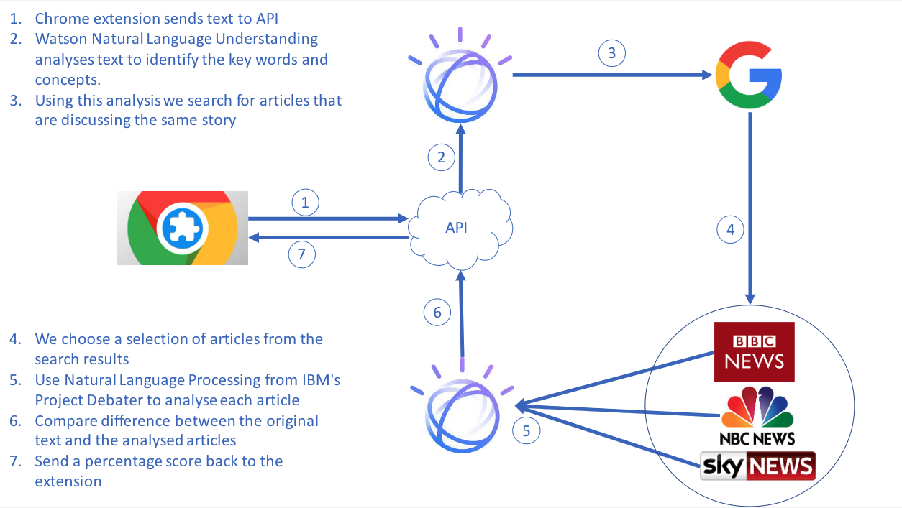
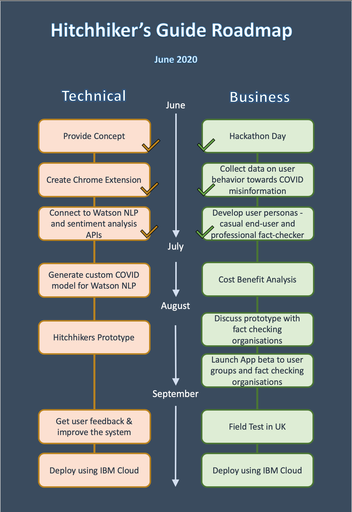

<h1 align="center">Welcome to Hitchhikers 👋</h1>
<p>
  
  <a href="#" target="_blank">
    
  </a>
</p>

> Helping people spot misinformation on the internet, using Watson Natural Language Understanding

## Contents

1. [Description](#description)
1. [Demo video](#demo-video)
1. [The architecture](#the-architecture)
1. [Project roadmap](#project-roadmap)
1. [Getting started](#getting-started)
1. [Running the tests](#running-the-tests)
1. [Built with](#built-with)
1. [Authors](#authors)
1. [License](#license)
1. [Acknowledgments](#acknowledgments)

## Description

### What's the problem?

If you use social media, you'll probably have come across misinformation or fake news, whether you knew it or not. Not everyone can spot every piece of fake news, so many people unfortunately believe it, or even help spread it like wild fire.
Misinformation and fake news during the COVID-19 pandemic has harmed or even killed numerous people.
This has prompted social media companies such as Facebook and Twitter to try to flag or remove misinformation on their sites. In March and April 2020, Facebook placed warning labels on 90 million pieces of COVID-19 content alone [1].
But social media is too large and fast-moving for them to spot every false claim. Facebook and Twitter contract third party companies to check facts, but the workload is excessive even for them. This had led some fact-checking companies such as snopes.com to even quit working with Facebook in 2019 [2].
Fact checkers struggle to sort fact from fiction - it can feel like finding a needle in a haystack of information. Fact checkers are often overwhelmed and this leads to mistakes, where misinformation is not spotted and removed [3]. Facebook themselves admitted a 10% error rate, equating to 300,000 daily posts left up [3].
So what if we could help fact checkers spot misinformation on social media easily?

[1] https://www.bbc.co.uk/news/technology-52903680

[2] https://www.telegraph.co.uk/technology/2019/02/02/snopes-quits-facebooks-fact-checking-programme-saying-has-become/

[3] https://www.technologyreview.com/2020/06/08/1002894/facebook-needs-30000-of-its-own-content-moderators-says-a-new-report/

### Solution
Our browser extension identifies posts on social media that are likely to be false, and highlights it seamlessly on the page. This helps fact checkers spot claims that are likely to be false, enabling them to review and remove much more misinformation than they can at the moment.

Here's how our extension works:
1. When a user is browsing social media, The Hitchhiker's Guide uses IBM Watson's Natural Language processing and sentiment analysis to extract the central "Claim" from the post.
1. Next we convert the "Claim" into a searchable query and then use the Microsoft Bing search API to find articles with a range of opinions on the topic.
1. Then IBM Watson is again utilised to decide whether the articles returned from the Bing search agree or disagree with the "Claim" and provides a percentage summary to indicate the general consensus.
1. Once the data is received by the Chrome extension the social media post is highlighted to give the user instant feedback. 

The Hitchhiker's Guide automates steps for fact-checkers, such as helping them find useful sources. It also provides summarises the current public opinion on the given claim.
Our solution can be used to spot misinformation regarding COVID-19, but it can also be extended to identify misinformation about other important areas such as climate change and politics.


## Demo video
[Watch the Video](https://youtu.be/CKrPHHcnX9c)

## The architecture


## Project roadmap


## Getting started

These instructions will get you a copy of the project up and running on your local machine for development and testing purposes. See deployment for notes on how to deploy the project on a live system.

### Prerequisites

* Google Chrome to run the extension
* Node.js
* An API Key and URL for IBM Watson Natural Language
```sh
# export these into your terminal before you run it
export NATURAL_LANGUAGE_UNDERSTANDING_IAM_APIKEY="";
export NATURAL_LANGUAGE_UNDERSTANDING_URL="";
# See more here: https://www.npmjs.com/package/@ibm-watson/natural-language-understanding-nodejs#prerequisites
```


* An API Key for Microsoft Bing Search API
```sh
# export these into your terminal before you run it
export BING_SEARCH_APIKEY="";
# See more here: https://azure.microsoft.com/en-us/services/cognitive-services/bing-news-search-api/
```

### Install and build

```sh
# From top level directory

# Install dependencies
npm run install:all

# Build client
npm run build:all
```

### Usage


#### Server

```sh
# From top level directory
npm start
```

#### Chrome Extension

```
Visit: chrome://extensions/
Enable: Developer mode
Press: Load Unpacked
Click: extension folder
```

Once the server is running and you've loaded the Chrome Extension, go to your Twitter timeline and watch as the Tweets are analysed.

From there you can easily see the different view points by clicking on the "click here for more information" button that is highlighted.

## Running the server tests
*Note: you need the API keys as described in the prerequisites*

```bash
cd server && npm install && npm run apitest
```

## Built with

* [IBM Watson Natural Language](https://www.ibm.com/uk-en/cloud/watson-natural-language-understanding) - Used to extract the "claim" from a social media post
* [Microsoft Bing Search API](https://azure.microsoft.com/en-us/services/cognitive-services/bing-news-search-api/) - Used to get articles about a topic
* [Express.js](https://expressjs.com/) - Powers the Node.js server
* [React.js](https://reactjs.org/) - Handles the front end (Home and more info pages)

## Authors

* **Craig Forrest** - *Initial work, recently left IBM* - https://github.com/CForrest97
* **Richard Waller** - https://github.com/rwalle61
* **Matt Emerson** - https://github.com/mattemerson1
* **Cameron Roberts** - https://github.com/cameronldroberts
* **James Wallis** - https://github.com/james-wallis

See also the list of [contributors](https://github.com/james-wallis/hitchhikers/graphs/contributors) who participated in this project.

## License

This project is licensed under the Apache 2 License - see the [LICENSE](LICENSE) file for details

## Acknowledgments

* Based on [the Code and Response README template](https://github.com/Code-and-Response/Project-Sample/blob/master/README.md).
